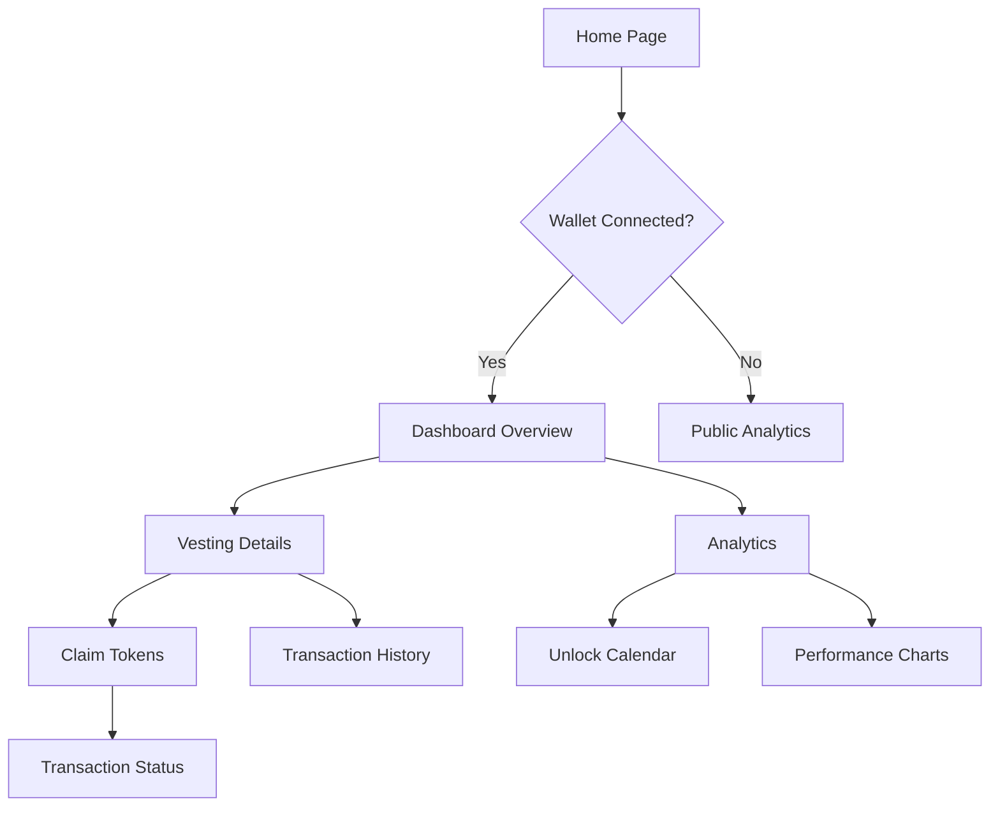

## 1. Product Overview
Vesting Dashboard is a web application that enables users to track, manage, and visualize token vesting schedules on the blockchain. The platform provides real-time insights into vesting progress, unlock schedules, and token distribution analytics.

The dashboard solves the problem of complex vesting schedule tracking for token holders, investors, and project teams by providing an intuitive interface to monitor vesting progress and upcoming unlocks. It targets cryptocurrency investors, project teams managing token distributions, and financial analysts tracking token economics.

## 2. Core Features

### 2.1 User Roles
| Role | Registration Method | Core Permissions |
|------|---------------------|------------------|
| Visitor | No registration required | View public vesting schedules and basic analytics |
| Wallet User | Web3 wallet connection | View personal vesting data, claim unlocked tokens, set notifications |
| Premium User | Wallet + subscription payment | Advanced analytics, custom alerts, portfolio tracking, export reports |

### 2.2 Feature Module
Our vesting dashboard consists of the following main pages:
1. **Dashboard Overview**: Portfolio summary, active vesting schedules, upcoming unlocks, total vested value.
2. **Vesting Details**: Individual vesting schedule view, unlock timeline, transaction history, claim functionality.
3. **Analytics**: Portfolio performance charts, vesting progress visualization, unlock calendar, token distribution insights.

### 2.3 Page Details
| Page Name | Module Name | Feature description |
|-----------|-------------|---------------------|
| Dashboard Overview | Portfolio Summary | Display total vested tokens, claimed amount, remaining locks, estimated value in USD |
| Dashboard Overview | Active Schedules | List all active vesting contracts with progress bars, next unlock dates, and quick actions |
| Dashboard Overview | Upcoming Unlocks | Show next 30 days of unlock events with countdown timers and claim status |
| Vesting Details | Schedule Viewer | Display detailed vesting timeline with cliff periods, unlock percentages, and historical data |
| Vesting Details | Claim Interface | Enable users to claim unlocked tokens through MCP API integration with transaction status |
| Vesting Details | Transaction History | Show all vesting-related transactions with links to blockchain explorers |
| Analytics | Performance Charts | Visualize vesting progress over time with interactive charts and filters |
| Analytics | Unlock Calendar | Monthly/weekly calendar view of all upcoming unlock events across all vesting schedules |
| Analytics | Distribution Insights | Analyze token distribution patterns, holder concentration, and vesting velocity |

## 3. Core Process
**Wallet User Flow**: User connects Web3 wallet → Dashboard fetches vesting data via MCP APIs → User views portfolio overview → User navigates to specific vesting schedule → User claims unlocked tokens through MCP API → Transaction confirmation and status update.

**Visitor Flow**: Visitor accesses dashboard → Views public vesting data and analytics → Can search for specific projects or addresses → Limited to read-only functionality without wallet connection.

## 4. User Interface Design

### 4.1 Design Style
- **Primary Colors**: Deep blue (#1E3A8A) for headers, emerald (#10B981) for positive values/actions
- **Secondary Colors**: Gray scale for backgrounds (#F9FAFB), dark gray (#374151) for text
- **Button Style**: Rounded corners (8px radius), gradient backgrounds for primary actions
- **Typography**: Inter font family, 14px base size, clear hierarchy with proper font weights
- **Layout**: Card-based design with subtle shadows, responsive grid system
- **Icons**: Modern line icons from Lucide or Heroicons, consistent 20px size

### 4.2 Page Design Overview
| Page Name | Module Name | UI Elements |
|-----------|-------------|-------------|
| Dashboard Overview | Portfolio Summary | Large metric cards with animated counters, sparkline charts, gradient backgrounds |
| Dashboard Overview | Active Schedules | Horizontal progress bars with milestone markers, hover effects for detail preview |
| Vesting Details | Schedule Viewer | Interactive timeline with zoom controls, color-coded unlock phases, tooltips on hover |
| Analytics | Performance Charts | Dark-themed charts with multiple timeframes, comparison tools, export functionality |

### 4.3 Responsiveness
Desktop-first design approach with mobile adaptation. Primary dashboard optimized for 1440px+ screens, tablet view at 768px+, mobile view with stacked cards and simplified navigation. Touch-optimized interactions for claim buttons and chart navigation.

### 4.4 Data Visualization
Charts use Chart.js or D3.js with smooth animations, tooltips showing exact values and dates. Color coding: green for unlocked/claimed tokens, blue for locked tokens, red for expired/unclaimed tokens. Interactive elements respond to hover with subtle scale and shadow transitions.