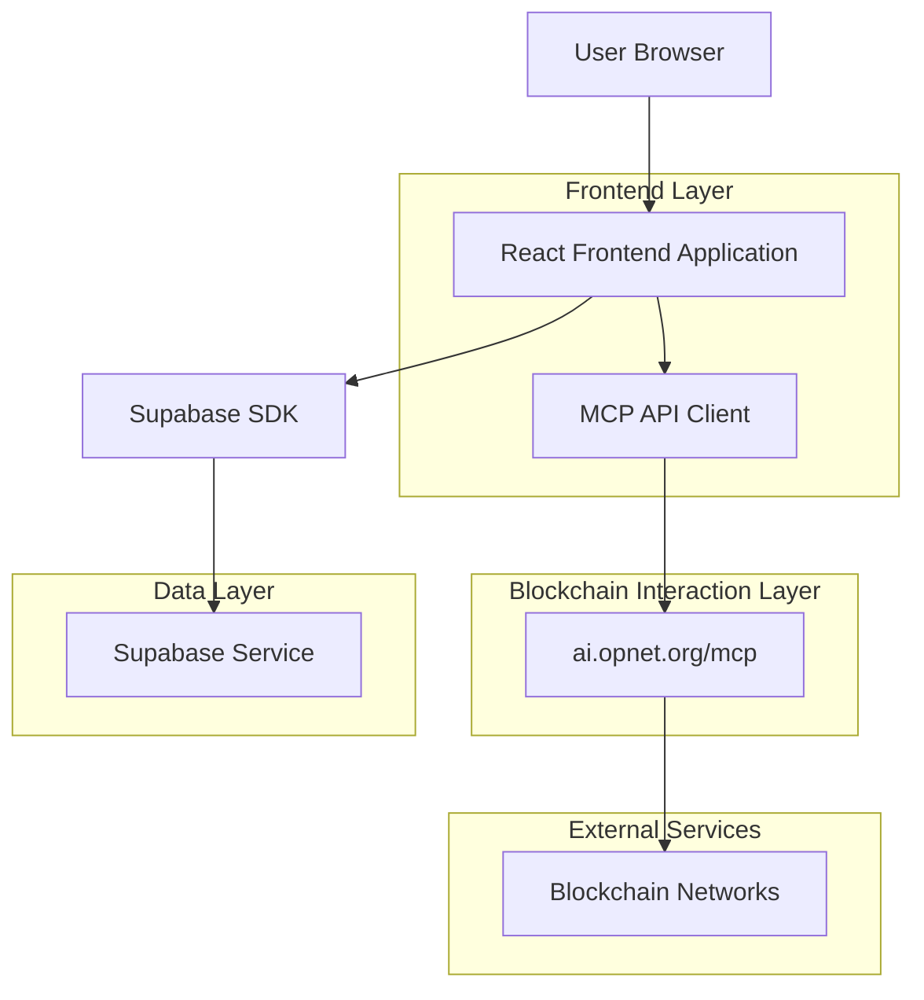
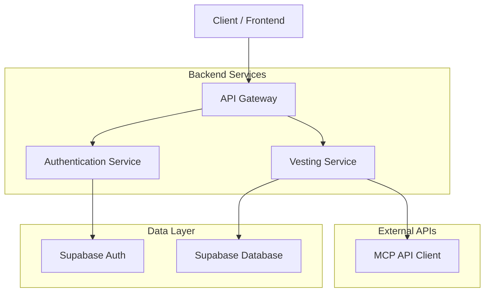
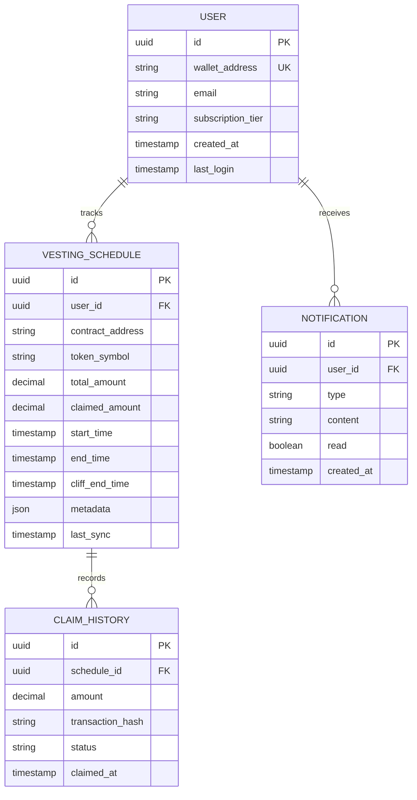

## 1. Architecture design



## 2. Technology Description
- Frontend: React@18 + tailwindcss@3 + vite
- Initialization Tool: vite-init
- Backend: Supabase (PostgreSQL + Auth + Storage)
- Blockchain Integration: MCP API Client (ai.opnet.org/mcp)
- State Management: React Context + SWR for data fetching
- Charts: Chart.js + react-chartjs-2
- Web3: ethers.js for wallet connection and transaction signing

## 3. Route definitions
| Route | Purpose |
|-------|---------|
| / | Landing page with wallet connection and feature overview |
| /dashboard | Main dashboard showing portfolio overview and active vesting schedules |
| /vesting/:contractId | Detailed view of specific vesting schedule with claim functionality |
| /analytics | Analytics page with charts and unlock calendar |
| /settings | User preferences and notification settings |

## 4. API definitions

### 4.1 MCP API Integration
**Vesting Data Fetch**
```
POST https://ai.opnet.org/mcp/query
```

Request:
| Param Name| Param Type  | isRequired  | Description |
|-----------|-------------|-------------|-------------|
| method    | string      | true        | "getVestingSchedules" |
| walletAddress | string  | true        | User's wallet address |
| network   | string      | true        | Blockchain network (ethereum, polygon, etc.) |

Response:
```json
{
  "success": true,
  "data": {
    "schedules": [
      {
        "contractAddress": "0x...",
        "tokenSymbol": "TOKEN",
        "totalAmount": "1000000",
        "vestedAmount": "400000",
        "claimableAmount": "100000",
        "startTime": 1640995200,
        "endTime": 1672531200,
        "cliffEndTime": 1648684800
      }
    ]
  }
}
```

**Token Claim**
```
POST https://ai.opnet.org/mcp/execute
```

Request:
| Param Name| Param Type  | isRequired  | Description |
|-----------|-------------|-------------|-------------|
| method    | string      | true        | "claimVestedTokens" |
| contractAddress | string | true       | Vesting contract address |
| amount    | string      | true        | Amount to claim (in wei) |
| walletSignature | string | true     | Signed transaction data |

## 5. Server architecture diagram


## 6. Data model

### 6.1 Data model definition


### 6.2 Data Definition Language
User Table (users)
```sql
-- create table
CREATE TABLE users (
    id UUID PRIMARY KEY DEFAULT gen_random_uuid(),
    wallet_address VARCHAR(42) UNIQUE NOT NULL,
    email VARCHAR(255),
    subscription_tier VARCHAR(20) DEFAULT 'free' CHECK (subscription_tier IN ('free', 'premium')),
    created_at TIMESTAMP WITH TIME ZONE DEFAULT NOW(),
    last_login TIMESTAMP WITH TIME ZONE DEFAULT NOW()
);

-- create indexes
CREATE INDEX idx_users_wallet_address ON users(wallet_address);
CREATE INDEX idx_users_subscription_tier ON users(subscription_tier);
```

Vesting Schedule Table (vesting_schedules)
```sql
-- create table
CREATE TABLE vesting_schedules (
    id UUID PRIMARY KEY DEFAULT gen_random_uuid(),
    user_id UUID REFERENCES users(id) ON DELETE CASCADE,
    contract_address VARCHAR(42) NOT NULL,
    token_symbol VARCHAR(20) NOT NULL,
    total_amount DECIMAL(78,0) NOT NULL,
    claimed_amount DECIMAL(78,0) DEFAULT 0,
    start_time TIMESTAMP WITH TIME ZONE NOT NULL,
    end_time TIMESTAMP WITH TIME ZONE NOT NULL,
    cliff_end_time TIMESTAMP WITH TIME ZONE,
    metadata JSONB DEFAULT '{}',
    last_sync TIMESTAMP WITH TIME ZONE DEFAULT NOW(),
    created_at TIMESTAMP WITH TIME ZONE DEFAULT NOW()
);

-- create indexes
CREATE INDEX idx_vesting_user_id ON vesting_schedules(user_id);
CREATE INDEX idx_vesting_contract ON vesting_schedules(contract_address);
CREATE INDEX idx_vesting_token ON vesting_schedules(token_symbol);
```

Claim History Table (claim_history)
```sql
-- create table
CREATE TABLE claim_history (
    id UUID PRIMARY KEY DEFAULT gen_random_uuid(),
    schedule_id UUID REFERENCES vesting_schedules(id) ON DELETE CASCADE,
    amount DECIMAL(78,0) NOT NULL,
    transaction_hash VARCHAR(66) UNIQUE NOT NULL,
    status VARCHAR(20) DEFAULT 'pending' CHECK (status IN ('pending', 'confirmed', 'failed')),
    claimed_at TIMESTAMP WITH TIME ZONE DEFAULT NOW()
);

-- create indexes
CREATE INDEX idx_claim_schedule_id ON claim_history(schedule_id);
CREATE INDEX idx_claim_status ON claim_history(status);
CREATE INDEX idx_claim_claimed_at ON claim_history(claimed_at DESC);
```

### 6.3 Supabase Row Level Security Policies
```sql
-- Enable RLS
ALTER TABLE users ENABLE ROW LEVEL SECURITY;
ALTER TABLE vesting_schedules ENABLE ROW LEVEL SECURITY;
ALTER TABLE claim_history ENABLE ROW LEVEL SECURITY;

-- Users can only read their own data
CREATE POLICY "Users can view own data" ON users
    FOR SELECT USING (auth.uid() = id);

-- Users can only read their own vesting schedules
CREATE POLICY "Users can view own schedules" ON vesting_schedules
    FOR SELECT USING (auth.uid() = user_id);

-- Users can only read their own claim history
CREATE POLICY "Users can view own claims" ON claim_history
    FOR SELECT USING (EXISTS (
        SELECT 1 FROM vesting_schedules 
        WHERE vesting_schedules.id = claim_history.schedule_id 
        AND vesting_schedules.user_id = auth.uid()
    ));

-- Grant permissions
GRANT SELECT ON users TO authenticated;
GRANT SELECT ON vesting_schedules TO authenticated;
GRANT SELECT ON claim_history TO authenticated;
```